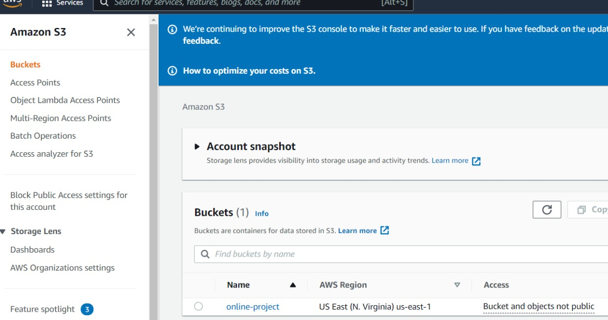
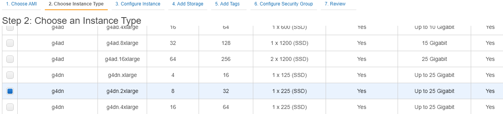
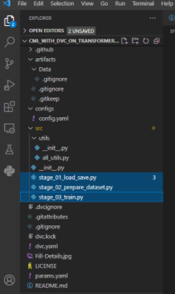
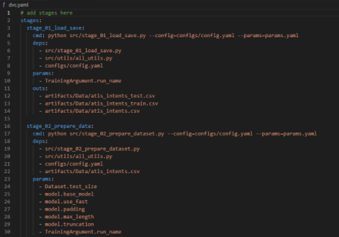
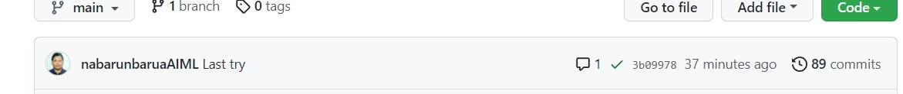
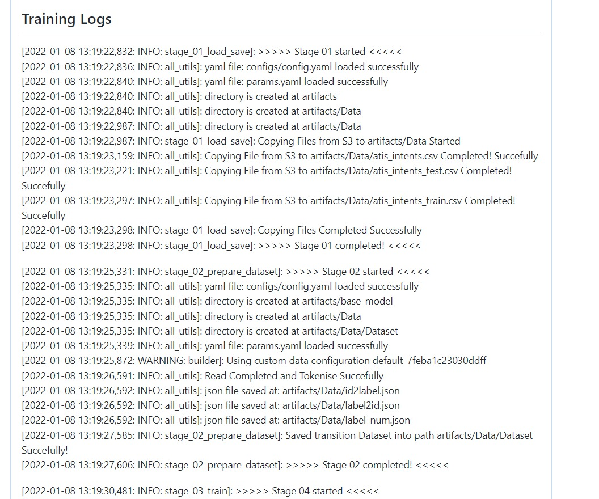

# Continuous Machine Learning on Huggingface Transformer with DVC including Weights & Biases implementation.

[](https://hits.seeyoufarm.com)

Main idea of this project is to explain how CML can be implemented in an NLP Project therefore main focus of this Project is to explain how CML can be implemented. We assume that user is well verse in 🤗 Transformers , DVC & Weights&Biases (Wandb) Implementations.

Below are the online resource used for building this Project.

- [DVC Youtube Playlist](https://www.youtube.com/playlist?list=PL7WG7YrwYcnDBDuCkFbcyjnZQrdskFsBz) and [DVC CML Official Doc](https://cml.dev/doc/self-hosted-runners?tab=AWS)
- [Official Huggingface Website](https://huggingface.co/docs)
- [Weights & Biases Official Doc](https://docs.wandb.ai/guides/integrations/huggingface)
- Apart from above from iNeuron's Team Sunny Bhaveen Chandra Session on DVC Helped to complete this project

Before we begin with the session few things that which need to be setup are as follows:
- One AWS IAM user with EC2 & S3 Developer Access 
- S3 Bucket to store the Dataset
- Second EC2 Spot Instance need to be requested in advance if not done earlier.

Please follow these online Resource AWS related information
- [Youtube Resource 1](https://www.youtube.com/watch?v=rYHt0gtRKFg&t=180s)
- [Youtube Resource 2](https://www.youtube.com/watch?v=GCt-cymgdvo)
- [For right GPU Selection](https://towardsdatascience.com/choosing-the-right-gpu-for-deep-learning-on-aws-d69c157d8c86) and for the same [Youtube Link](https://www.youtube.com/watch?v=4bVrIbgGWEA)

In this project we want to implement Transformer Classification for [Kaggle Dataset](https://www.kaggle.com/hassanamin/atis-airlinetravelinformationsystem), idea is to implement DVC so that from DVC studio we can do the experiments, where as in Transformers Weights & Biases have in built implementation which allows to save Best Model's weights & Metrices. 

We can use DVC for Metric tracking but for that further changes & implementation need to be implemented. On the other hand, Weights & Biases just need minimalist changes in any transformer code to start tracking. One major advantage which I see in using Weights & Biases i.e. it save best model which otherwise we had to do after every experiments.

Now I believe that we're through with the goal and clear vision as in what we want to do in this project. 

Lets begin by click and going into this [Template Repository](https://github.com/nabarunbaruaAIML/project-template-with-DVC) 

Once into Template Repository Please click Button **Use this Template**.


then fill Details and create repository from the template.


# Overview:
### Why DVC ?


Data processing or ML pipelines typically start a with large raw datasets for most usecases , inclusive of intermediate featurization and training stages .This then finally produces a final tuned model along with the needed accuracy metrics. Versioning of these large data files and directories alone is not sufficient.We also need to understand  How the data is filtered, transformed , enriched (if the case be) , or used to finally train  the ML models? DVC introduces a mechanism to capture and monitor those data pipelines — series of data processes that produce a final result (A final state as that of a graph).
DVC pipelines and their data can also be easily versioned (using Git). This allows you to better organize your project, and reproduce your workflow  when and where required and the results can totally ace it!


### Why S3?

Amazon S3 is what we have used as a remote storage for Data .Firstly, starting with the platform github, we have restrictions storing data at scale in github (limit being as little as 100mb) .Secondly, as part of best practices , it is never considered safe to store data on Code repositories (be is privately hostel Github,Gitlab,Bitbucket etc)
As the enterprise softwares thes days have a prerequisite to be GDPR compliant. The secrecy of data is of high importance.
Now, Amazon S3 being one of the most reliable and secure storage , we chose it for our use case too. S3 is also highly agile and has the all-time availability trait.We may for the most part find it difficult to sometimes store and manage data, however, with S3 its such a breeze to manage data at such low costs. (You can also refer the Boto-core section above for integration information)
So head over to amazon S3 setup the account and create a bucket with a decent storage. 
This bucker can then be connected to for file transferring using tools like Putty,MobaXterm,FileZilla etc.
This way you can place the files and get the location .

### Why EC2?

EC2 is a cost efficient virtual server in Amazon's  Elastic Compute Cloud for Amazon Web Services .
Its highly elastic, scalable and reliable when it comes to Failover management and information security.There are out of the box features such as Elastic Load balancing which automatically distributes the traffic to the active instances and recovers the unhealthy instances. However , we would be using these features only during out deployment pipeline. 
So, to perform the model training, you would have to have an instance of the below kind at the least:

Because, as we know, Transformers are resource intensive .


### Is there a Rigid File Structure for DVC ?
Yes , More than rigidity it means a standard which way it becomes very easy for organization and continuous iterations of change .


As seen above, stage_01_load_save.py , stage_02_prepare_dataset.py , stage_03_train.py 
are the stages of the DAG or the DVC pipeline. yaml files such as dvc.yaml , params.yaml and config.yaml carries the major mandatory configurations. dvc.yaml  being the control file here with all the Stage details like follows :

The all_utils.py can be seen as a collection of operational python functions which is such that it is modular and reusable which constitutes File operations etc


## Now follow below steps for kickstarting the project:

### STEP 01- Create local repository after cloning the repository. We can use git bash for cloning if using windows system. If Linux/Mac OS then Terminal will work.

### STEP 02- Create a conda environment after opening the repository in VSCODE

```bash
conda create --prefix ./env python=3.7 -y
```
Activate the environment in the VSCode by executing the following command:
```bash
conda activate ./env
```
OR
```bash
source activate ./env
```

### STEP 03- install the requirements
```bash
pip install -r requirements.txt
```

### STEP 04- initialize the dvc project
```bash
dvc init
```

### STEP 05- commit and push the changes to the remote repository
```bash
git add .
git commit -m "Detailed Commit for further reference"
git push origin master    # Branch of choice
```

### STEP 06- Push operation triggers for the Pipeline
The push operation triggers the entire training pipeline as explained on top provided all required API keys and 
configurations are in place with the same sequence.


### STEP 07- Push as the Github Event: 
Github listens to Push as an Event by the github workflow .This then starts the pipeline defined in the workflow as can be seen below in the Actions tab


The configured DVC stages are executed now one after the other in a EC2( Ubuntu 18 OS) configured instance (our case) else if the instance is not configured then github runs these on a spot instance internally and after the completion of the entire pipeline ,it also cleans up the resources utilized leaving us with only the Metrics and Best model saved.

As mentioned before, the order of execution of stages can be seen below:


Detailed logs of the same can also be found by clicking the step: Now as seen below, the training starts and finishes


Logs of custom level (info,debug,error) can also be customized and accessed from the EC2 instance as well if we are using a dedicated instance and not the spot instance of Github.


### STEP 08- Experiment Management:
DVC Studio - [DVC Studio](https://studio.iterative.ai)
This helps us in ML experiment tracking, visualization, and collaboration(While a team of developers work with different sets of experiments).DVC Studio does bookkeeping automatically too. See below: 


Since DVC Studio integrates with github smoothly, we can review and cherry pick each commit related to the experiments and this gives a whole lot of flexibility.

### STEP 08- Evaluation Metrics Management :
wandb  -Weights and Biases  [Wandb](https://wandb.ai/site)
Although, DVC Studio This helps us in ML experiment tracking, visualization, and collaboration and best models if used ,
Weights and Biases(wandb) makes it even more easier by recording evaluation metrices and providing insights with plots.


### STEP 09- Best Model Selection  :
wandb  -Weights and Biases  [Wandb](https://wandb.ai/site)
Although, DVC Studio This helps us in ML experiment tracking, visualization, and collaboration and best models if used ,
Weights and Biases(wandb) makes it even more easier by recording evaluation metrices and providing insights with plots.

As can be seen below are the best weights we have managed obtain on the different experiments .This is a very useful feature as finding the best weights can sometimes be a hassle.


### STEP 10- Ending note :
When all the steps are finished, the last event in the cml workflow is executed which is to comment on the thread.
```bash
cml-send-comment report.md 
```  
When this happens, the message notification will pop on the user banner as you can see.


The complete Training logs can also be found in report.md  as we have configured the below steps in the cml workflow file (ci-cd.yaml)
```bash
echo "## Training Logs" >> report.md
cat logs/running_logs.log >> report.md
```  
See below: 



# W.I.P : Deployment Pipeline will shortly follow this repository
##  Dockerized Container Application clusters with Kubernetes orchestration 


